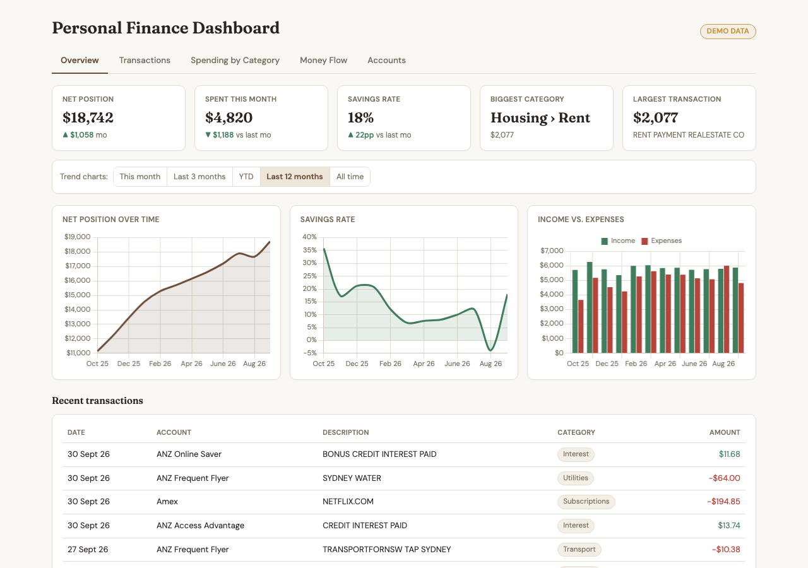
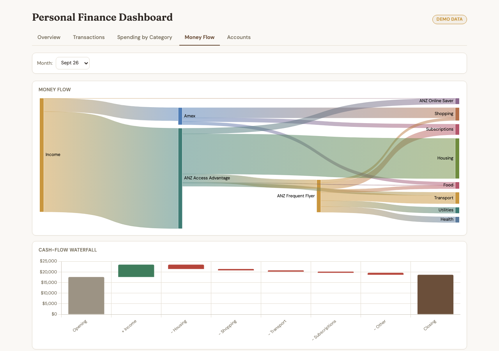
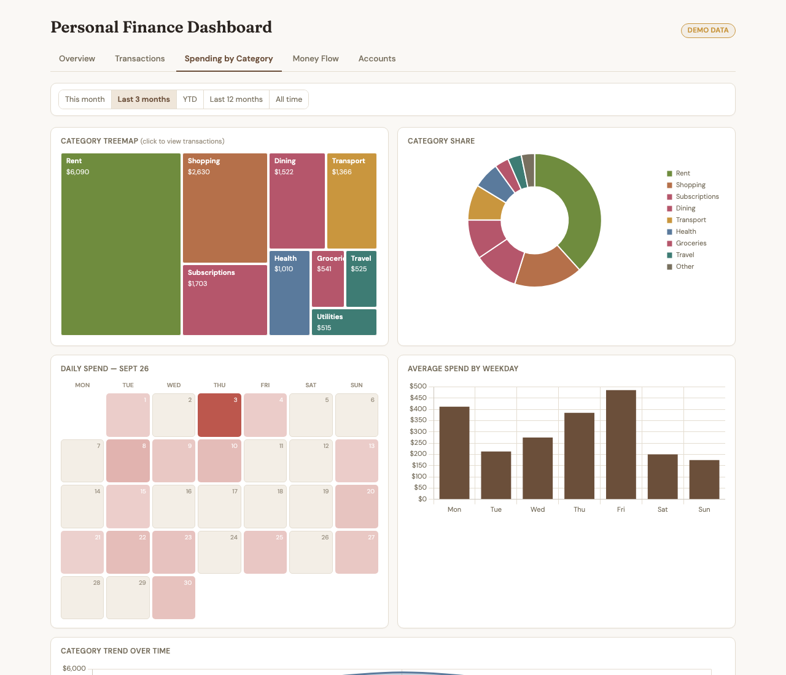
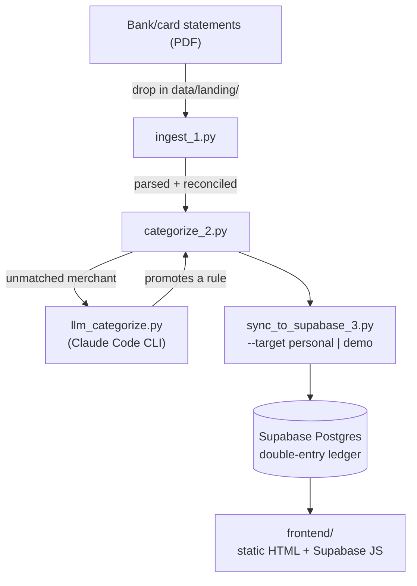

# Personal Finance Dashboard

A personal transaction-tracking and budgeting dashboard: ingests bank and credit card PDF
statements into a double-entry Postgres ledger (Supabase), categorizes every transaction with
rules plus an LLM fallback, detects internal transfers between your own accounts, and serves a
read-only dashboard — five tabs, full drill-down, no manual spreadsheet work.





**[Try the live demo](https://dylanbai4028.github.io/personal-finance-dashboard/)** — a public
GitHub Pages deployment running entirely on synthetic data (see [Privacy](#privacy--two-deployments)
below). Full pipeline included in this repo, so you can also run it yourself against your own
real statements, entirely locally.

## Why this exists

Bank apps show you *a* balance and *a* transaction list, but not a real double-entry ledger, not
a categorization pipeline that learns your own merchants over time, and not a dashboard that
answers "where did my money actually go this quarter" without you building a spreadsheet by hand.
This repo is that pipeline: point it at your own statement PDFs, and it builds a proper ledger
(every transaction balances across at least two accounts, the same modeling idea behind
[Beancount](https://github.com/beancount/beancount)), categorizes everything (a rules file that
grows itself — a merchant only ever needs an LLM lookup once, then it's a rule), and renders it
all in a dashboard with five tabs: Overview, Transactions, Spending by Category, Money Flow, and
Accounts.

## How it works



Three numbered stages, run in order by `src/run_pipeline.py`:

1. **`ingest_1.py`** — detects which of the supported statement formats a PDF is (by its own
   header text, not file naming), parses it with the matching adapter in `src/lib/ingest/`, and
   checks the extracted transactions against the statement's *own* declared totals before trusting
   any of it. A statement that fails detection or reconciliation goes to `data/needs_review/`
   instead of silently corrupting the ledger.
2. **`categorize_2.py`** — applies your rules file (most-specific-match wins), detects transfers
   between your own tracked accounts, and falls back to the Claude Code CLI for anything unmatched
   — batched, and cached so a repeat merchant across a multi-year backfill only ever costs one call.
   Every LLM decision gets written back as a new rule, tagged `source: llm` so it stays visibly
   distinct from a rule you wrote yourself.
3. **`sync_to_supabase_3.py`** — upserts into either the `demo` or `personal` Supabase project.

The frontend (`frontend/`) is plain HTML/CSS/JS with no build step — it queries Supabase directly
from the browser via the Supabase JS client, using five Postgres views (see
[`ledger/schema.sql`](ledger/schema.sql)) so it never has to sum thousands of rows client-side.

## Privacy — two deployments

This repo is built to be genuinely safe to run publicly:

- **`frontend/config.js`** (committed) points at a **public demo Supabase project**, seeded
  entirely with synthetic data from `src/lib/demo_data_generator.py` — run through the *real*
  categorization pipeline, not pre-labeled, so the demo actually proves the categorization
  approach works, not just the dashboard rendering canned numbers.
- **`frontend/config.local.js`** (gitignored) points at a **private Supabase project** holding
  your own real transactions. It's never committed, never deployed, and only ever loaded when you
  run the frontend locally.
- **`data/`**, **`rules/*.local.yaml`**, and **`.env`** are all gitignored — your real account
  numbers and category rules (which end up containing real merchant and third-party names) never
  touch git history.
- The Supabase anon/publishable key that ships in `config.js` is safe to expose because the demo
  project holds nothing but synthetic data. **The personal project's key is not** — this project
  deliberately runs without Row-Level Security (see `ledger/schema.sql`'s access-grants section),
  so treat `config.local.js` and the personal project's key with the same handling discipline as a
  password.

## Try it in 60 seconds (no real data needed)

```bash
git clone https://github.com/DylanBai4028/personal-finance-dashboard.git
cd personal-finance-dashboard
uv venv && uv pip install -e .
```

1. Create a free [Supabase](https://supabase.com) project, apply `ledger/schema.sql` in its SQL
   editor.
2. Copy `.env.example` to `.env` and fill in that project's URL + service-role key under
   `SUPABASE_DEMO_*`.
3. Generate and sync synthetic data, then categorize it through the real pipeline:
   ```bash
   uv run python src/lib/demo_data_generator.py
   uv run python src/categorize_2.py --rules rules/category_rules.example.yaml \
     --accounts rules/accounts.example.yaml --processed-dir data/demo_processed
   uv run python src/sync_to_supabase_3.py --target demo --processed-dir data/demo_processed
   ```
4. Copy that project's URL + anon/publishable key into `frontend/config.js`.
5. Open `frontend/index.html` in a browser (or serve the folder — `python -m http.server`, run
   from inside `frontend/`).

## Running it on your own real statements

The pipeline currently has adapters for ANZ deposit accounts (Access Advantage / Online Saver),
ANZ credit cards, and Amex — see `src/lib/ingest/` and the "Adapting this to your own statements"
note below if yours differ.

1. Create a **second**, separate Supabase project for your real data (never reuse the demo one),
   apply `ledger/schema.sql`, and fill in `SUPABASE_PERSONAL_*` in `.env`.
2. Copy `rules/accounts.example.yaml` to `rules/accounts.local.yaml` and map your real account/BSB
   numbers to canonical names (`Assets:YourBank:Checking`, etc.) — this file is gitignored.
3. Copy `rules/category_rules.example.yaml` to `rules/category_rules.local.yaml` — starts empty
   beyond a couple of seed rules; it grows itself as you run the pipeline.
4. Drop your statement PDFs into `data/landing/`, then:
   ```bash
   uv run python src/run_pipeline.py
   ```
5. Copy your personal project's URL + anon/publishable key into `frontend/config.local.js` (copy
   the shape from `config.js` — this file is gitignored, so it's created fresh, not checked out).
6. Open `frontend/index.html` locally. It's never deployed — only `config.js` (the demo config)
   ships to GitHub Pages.

**Categorization needs the [Claude Code CLI](https://claude.com/claude-code)** installed and
logged in (`claude -p ...`) — it runs under your existing subscription's included usage rather
than metered API billing. If you'd rather call the Anthropic API directly instead (e.g. you don't
have a Claude subscription), `src/lib/llm_categorize.py` is the one file to change — swap the
`claude -p` subprocess call for a direct API request using the key in `.env`'s commented-out
`ANTHROPIC_API_KEY` line.

## Adapting this to your own statements

If your bank isn't one of the three already supported:

1. Add a new file in `src/lib/ingest/`, following the shape of an existing adapter (parse the
   table, extract transactions, reconcile against the statement's own declared totals).
2. Teach `detect.py` to recognize your statement's header text and dispatch to it.
3. Add your account to `rules/accounts.local.yaml`.

Nothing else in the pipeline needs to change — ingestion, categorization, and sync are all
adapter-agnostic.

## Project structure

```
personal-finance-dashboard/
├── src/
│   ├── run_pipeline.py         # runs the three stages below in order
│   ├── ingest_1.py              # PDF → parsed, reconciled, deduped transactions
│   ├── categorize_2.py          # rules + transfer detection + LLM fallback
│   ├── sync_to_supabase_3.py    # upsert into --target demo|personal
│   └── lib/
│       ├── ingest/               # one adapter per bank/card format + detection + dedup
│       ├── llm_categorize.py     # Claude Code CLI fallback, used by categorize_2.py
│       └── demo_data_generator.py
├── rules/                        # accounts.*.yaml, category_rules.*.yaml (.local.* gitignored)
├── ledger/schema.sql              # double-entry Postgres schema + 5 dashboard views
├── frontend/                      # static HTML/CSS/JS, no build step
│   ├── index.html / style.css / app.js
│   ├── config.js                  # demo project — committed
│   └── config.local.js            # personal project — gitignored
├── data/                          # landing/processed/needs_review — all gitignored
└── .github/workflows/deploy-pages.yml   # publishes frontend/ to GitHub Pages on push
```

## Known limitations (v1)

No split-transaction handling beyond a basic two-line posting, no amortization of one-time large
expenses, no subscription/recurrence detection, no live bank API integration, and no in-dashboard
editing — corrections happen by editing the rules file and re-running the pipeline.

## License

MIT — see [LICENSE](LICENSE).
