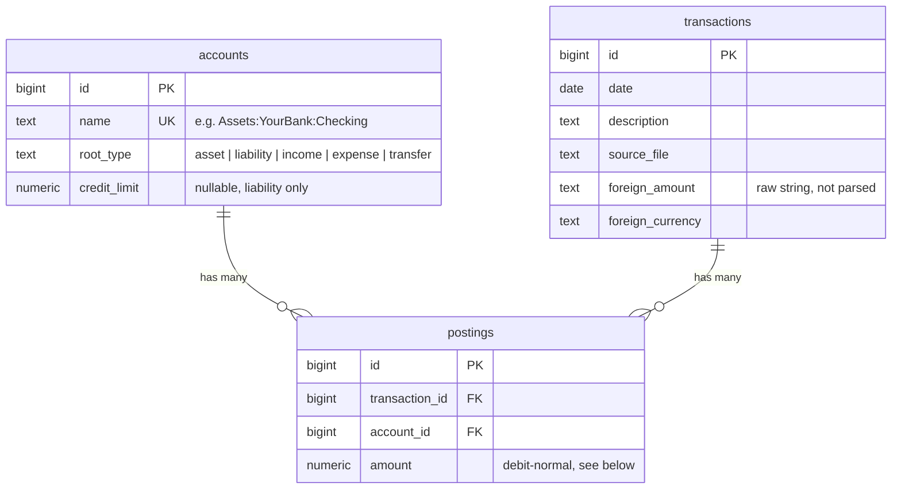

# The database, table by table

Three tables hold everything; five views do the aggregation the dashboard actually reads from. All of it is defined in [`ledger/schema.sql`](../ledger/schema.sql) — this doc explains what's there and why it's shaped this way, for a reader who's never worked with a double-entry ledger before.

> Account name examples below (`Assets:YourBank:Checking`, etc.) are placeholders. Real tracked-account names live only in the gitignored `rules/accounts.local.yaml`, never in code, comments, or docs.

## The double-entry idea, in one paragraph

Every transaction is split into two (or more) **postings** that sum to exactly zero. Spend $50 on groceries with a debit card, and two postings get written: `-$50` to the checking account, `+$50` to `Expenses:Food:Groceries`. Nothing is ever recorded as a single number sitting on one account — every dollar that increases one account's balance is matched by a dollar decreasing another's, which is what makes it possible to answer "where did this money actually go" reliably instead of just "how much is left."

## `accounts`

Holds *every* named thing money can move to or from — both real bank/card accounts (`Assets:YourBank:Checking`) and spending categories (`Expenses:Food:Groceries`), as colon-separated paths. A category is modeled as an account for the same reason Beancount does it: "how much did I spend on groceries" and "how much is in my checking account" are the same question — a running balance on a named account — just asked about a different kind of account.

- **`root_type`** — one of `asset`, `liability`, `income`, `expense`, `transfer`. This single column is what a posting's sign *means*: on an `asset` or `expense` account, a positive posting increases its balance; on a `liability` or `income` account, a *negative* posting does. This is the "debit-normal" convention mentioned throughout the codebase — assets and expenses behave the way most people already think of a bank balance or a running total (money in is positive); liabilities and income are the mirror image, which is what lets the two sides of any transaction sum to zero regardless of which kind of account paid.
- **`transfer`** is a special case: it doesn't mean "a real account," it means "movement between two of your own money pots." A payment against a credit card creates a posting on `Transfers:Internal`, not on the literal other account — because each statement (the card's own, and the checking account's own) is ingested completely independently, and a real transfer shows up once on *each* side. Posting the full amount to the literal other account on both sides would double it. As of this session, `Transfers:*` covers more than one pseudo-account (`Transfers:Internal`, `Transfers:Wise`, and others) for money moving to external accounts you still own outright (an overseas bank account, an investing platform) — all still excluded from income/expense totals the same way.
- **`credit_limit`** — nullable, only ever set on a liability (credit card) account, and only ever from that card's own statement (see `sync_to_supabase_3.py`'s credit-limit-by-date logic in [pipeline.md](pipeline.md)).

## `transactions`

One row per real-world transaction — a date, a description, and where it came from.

- **`source_file`** — provenance: which statement PDF this was parsed out of, kept so a questionable figure can always be traced back to its source. (`source_page` exists in the schema for the same purpose but isn't populated by any parser yet — always `NULL` today.)
- **`foreign_amount`** — stored as **text**, not a number, deliberately. Amex's own printed foreign-currency column doesn't consistently use AUD's comma-thousands/dot-decimal format (some European currencies print `1.239,00` — period-thousands, comma-decimal), and no currency code is printed per row to say which convention applies. Parsing it to a float would mean guessing a locale, so it's kept as the raw printed string and only ever shown, never calculated with.
- **`created_at`** — when the row was actually synced, which is what the dashboard's "data last ingested" line reads from (the *maximum* `created_at` across all transactions, not the transaction dates themselves).

## `postings`

The actual double-entry rows — always at least two per transaction, always summing to zero for that transaction. `amount` follows the debit-normal convention explained above under `root_type`. This table is deliberately thin (just `transaction_id`, `account_id`, `amount`) — everything else about a posting is looked up through its account or its transaction, not duplicated here.

## The views

Every view exists because the dashboard would otherwise have to sum thousands of raw posting rows client-side on every page load. Each one answers exactly one question:

| View | Question it answers | Mechanism | Used by |
|---|---|---|---|
| `v_account_balances` | What's the current balance of every account? | Sums all of an account's own postings, flipping the sign back to a normal-looking positive number for liability accounts (so a card shows "$500 owed," not "$-500") | Overview stat boxes, Accounts tab |
| `v_monthly_category_totals` | How much went to each expense category, per calendar month? | Groups expense postings by `date_trunc('month', date)` and category account | Spending by Category tab (treemap, donut, trend), Overview's "biggest category" |
| `v_monthly_income_expense` | Total income vs. total expense, per calendar month? | Groups by month and `root_type` (income vs. expense only), flipping income's sign the same way as the balance view | Overview's Net Position / Income vs. Expenses / Savings Rate charts |
| `v_daily_spend` | Total expense, per calendar day? | Groups expense postings by exact date, left at daily grain rather than pre-bucketed | Category tab's daily-spend heatmap and weekday pattern |
| `v_category_movers` | Which categories moved the most vs. a prior period? | Left at daily grain per category, deliberately *not* pre-aggregated to a fixed period — the dashboard picks whatever two date ranges it's comparing (which aren't always calendar months) and sums from here at query time | Category tab's "Movers vs. prior period" |

Raw `transactions`/`postings` rows (not a view) are queried directly wherever the dashboard needs individual rows rather than a total — the Transactions table, Category Deep-Dive's merchant breakdown, the Accounts tab's per-account history, and the "largest transaction" stat.

## Access

Both `anon` and `authenticated` roles get a plain `SELECT` grant on every table — no row-level security, since v1 is read-only everywhere and there's no per-row ownership to enforce. Every write happens locally, using the service-role key, never the key the frontend ships with. This is why the personal project's anon key is a real secret (see the README's Privacy section) — without RLS, that key *is* the entire access boundary for real data.
