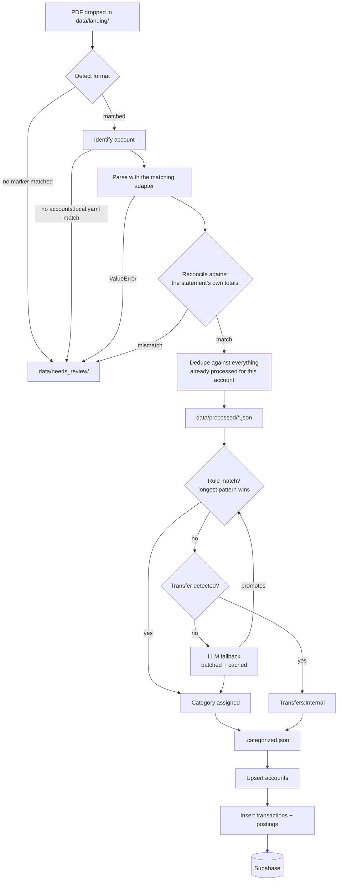

# The pipeline, step by step

The README covers the three-stage shape (ingest → categorize → sync) and why each stage exists. This doc goes one level deeper: the actual mechanism behind each step — the specific rule, algorithm, or check that makes it work, not just its name.

## Ingest (`ingest_1.py`)

**Detection** is a fixed lookup, not inference: four exact marker strings (`"ANZ ACCESS ADVANTAGE STATEMENT"`, `"ANZ ONLINE SAVER STATEMENT"`, `"ANZ FREQUENT FLYER BLACK"`, `"Statement of Account"`) are searched for in page 1's extracted text. Whichever one appears decides the format — nothing about the filename or folder is involved. No match means the file goes straight to `needs_review/`, not skipped or guessed at.

**Account identification** runs a format-specific regex over that same page-1 text to pull out whatever number identifies *which* account this is: BSB + account number for the two ANZ deposit formats, a 16-digit card number for the ANZ credit card, a membership number for Amex. That extracted value is then matched against `accounts.local.yaml`'s `match` blocks to resolve a canonical name like `Assets:YourBank:Checking` (the real account names live only in that gitignored file, never in code or docs — see the note under [database-schema.md](database-schema.md)). A `match` entry can be a *list* of values, not just one — needed because a card can be reissued mid-history, so an account's identifying number isn't guaranteed stable forever.

**Parsing** is genuinely different per format, since the three PDF layouts don't share a structure:
- **ANZ deposit accounts** (`anz_deposit.py`) have no gridlines, so rows are recovered by grouping words with the same rounded y-coordinate (`top`), then classifying each amount by its x-coordinate against calibrated column boundaries (Withdrawals / Deposits / Balance).
- **ANZ credit card** (`anz_credit_card.py`) is mostly one line of plain text per transaction, so this one works off `extract_text()` and a single regex, not word positions — simpler because the layout is simpler.
- **Amex** (`amex.py`) is the messiest: a transaction's date, description, and amount words can land up to a few pixels apart in `top` even though they belong to the same row, so rows are built by chain-linking nearby words together (each word compared against the *previous* word's position, not a fixed row anchor) rather than exact-position grouping. Amex also never prints a year per row, so the year is resolved by checking which of the statement's own start/end years the row's month+day actually falls inside (with a small buffer for settlement lag) — not by assuming dates print in chronological order, since Amex's own layout sometimes doesn't.

**Reconciliation** recomputes each statement's totals (deposits, withdrawals or debits/credits, closing balance) from the transactions just parsed, and compares them against the *bank's own* printed summary figures. A mismatch here means the parser misread something — these are the bank's own numbers, so they're assumed correct and the parser is assumed wrong.

**Dedup** (`dedupe.py`) identifies a transaction by a tuple of (account, date, amount, description, balance-if-available) — not a bank-issued ID, since none of these four formats print one. Balance is included specifically to distinguish two otherwise-identical transactions on the same day (e.g. two coffees at the same cafe for the same price) that really are two separate events, not a duplicate. This key is rebuilt fresh from everything already sitting in `data/processed/` each run, rather than kept in a separate index file — so deleting a processed file and re-running just re-admits it, no state to get out of sync.

A statement that fails any of the four checks above is moved to `data/needs_review/` with a `.error.txt` explaining why, and is never retried automatically — it's flagged once, not re-parsed and re-flagged every run.

## Categorize (`categorize_2.py`)

Every transaction goes through up to three checks, in order, stopping at the first one that resolves it:

**1. Transfer detection** (`find_transfer_target()`) runs several independent checks, not one:
- **Digit matching** — if the description contains another *tracked* account's own BSB+account number, card number, or similar (as a plain digit string), it's a transfer. Amex's membership number is deliberately excluded from this check, since Amex prints it partially masked and too few real digits survive to match reliably.
- **Card-payment wording** — on a liability (card) account, specific phrases banks actually print for "your payment has been received" (`"PAYMENT THANKYOU"`, `"ONLINE PAYMENT RECEIVED - THANKYOU"`, etc.) are recognized directly, since these payments reference a reference number, not the paying account's digits — the digit check above can never catch them.
- **Cash advance** — `"CASH ADVANCE 123456"` is a transfer (money moved out to another account); `"CASH ADVANCE FEE"` is a real, small expense. Distinguished by checking for the literal word `"FEE"` in the description.
- **Masked card number** — the deposit-account side of paying off a card sometimes prints the card's own number masked (e.g. `4564XXXXXXXX2091`), which the plain digit check can't match since it's not the full number. A separate regex looks for that masked shape and checks whether its visible first four digits belong to a known liability account.

**2. Category rules** (`match_rule()`): every rule whose `pattern` is a literal substring of the description is a candidate; whichever candidate has the *longest* pattern wins — not file order, not the first match. This is what lets a very specific pattern (a promoted rule for one exact recurring bill) take precedence over a shorter, more general one, without needing to order the rules file by hand.

**3. LLM fallback** (`lib/llm_categorize.py`), only for what's left unmatched:
- Every unmatched description is deduplicated by a **normalized key** first (digits collapsed to `#`, so `"COFFEE 12.50"` and `"COFFEE 8.90"` on different days share one key) — a repeat merchant across a whole multi-year backfill only ever triggers one real LLM call.
- Calls are **batched** (up to 40 descriptions per call, numbered rather than keyed by the description text itself, since the model can silently reformat text it's asked to echo back) and go through the Claude Code CLI (`claude -p`), not the Anthropic API directly — this runs under a Pro/Max subscription's included usage instead of metered billing.
- Every decision is written back into the rules file as a new rule (tagged `source: llm`, kept visibly distinct from a hand-written one) via `extract_merchant_pattern()`, which strips known boilerplate (card numbers, dollar amounts, "EFFECTIVE DATE ...") down to just the merchant text — so the *next* time that merchant appears, it's caught by the rules check in step 2 and never needs the LLM again.

Whatever target is resolved, the actual posting written is always a balanced pair: the source account's own posting, and the exact negation on the target account. Amounts are stored **debit-normal** (an asset or expense account's balance goes up on a positive posting; a liability or income account's balance goes up on a *negative* posting) — this is the one rule that makes a transaction's two postings always sum to exactly zero regardless of whether an expense was paid from a debit card or a credit card. Since the source PDFs print liability amounts the intuitive way instead (a credit card purchase is a positive number, the way the statement itself shows it), that one posting gets negated to match the convention before it's written.

## Sync (`sync_to_supabase_3.py`)

**Accounts are upserted first**, before any transaction — every account name referenced by *any* pending statement's postings is collected up front, so a transaction's own posting always has a valid `account_id` to point to by the time it's inserted. Upserting only ever writes `{name, root_type}`, deliberately never `credit_limit`, so an account being incidentally referenced as someone else's transfer target can never accidentally wipe out a real credit limit that was set from its own statement.

**Then transactions and postings are inserted**, one statement's worth at a time. There's no database-level uniqueness constraint stopping a re-run from inserting the same rows twice, so this relies entirely on a `.synced` marker file written next to each statement once it succeeds — the incremental-run logic checks for that marker's existence, not anything in the database itself.

**Credit limit updates** are applied by the statement's *own* transaction dates, not by whatever order the files happen to sync in (a file named `AUG2026` sorts alphabetically before `JUN2025`) — a small `_credit_limit_state.json` tracks the newest date a limit was last applied from, so a statement can never overwrite a newer one with older data just because it happened to run later.
