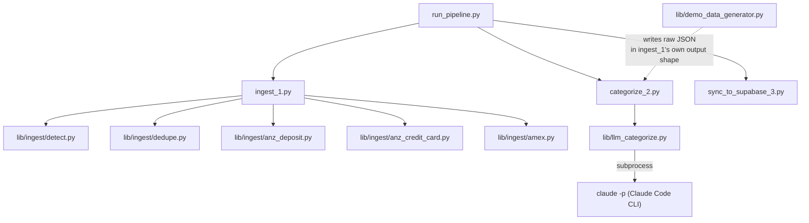

# How the scripts fit together

Who imports whom, and — for the files whose entire job *is* one specific mechanism — what that mechanism actually does. Not a catalog of every function in every file; only the ones worth knowing about to find your way around.

## The three numbered stages

- **`run_pipeline.py`** — the one-command entry point. Imports and calls the three stage scripts in order (`ingest_1.ingest_all()` → `categorize_2.run()` → `sync_to_supabase_3.sync_all()`). Each stage is also fully runnable on its own — this file adds no logic of its own beyond wiring them together and picking the right rules file for `--target personal` vs `--target demo`.
- **`ingest_1.py`** — turns a folder of PDFs into parsed, reconciled, deduped JSON. Its own `_accept()`/`_reject()` functions are the two possible outcomes for any statement: accepted files move to `data/processed/` alongside a `.json` of their parsed transactions; rejected ones move to `data/needs_review/` with a `.error.txt` saying why. See [pipeline.md](pipeline.md) for the actual detect → identify → parse → reconcile → dedupe sequence.
- **`categorize_2.py`** — turns raw transactions into balanced double-entry postings. `find_transfer_target()` and `match_rule()` are the two resolution mechanisms it tries before falling back to the LLM; `categorize_statement()` is what ties a transaction's resolved target to the actual signed posting pair written to disk.
- **`sync_to_supabase_3.py`** — pushes categorized JSON into Postgres over the REST API. `SupabaseClient` is a thin wrapper adding the service-role key's headers to every request; `ensure_accounts()` upserts accounts before anything else so every posting has a valid ID to reference.

## `lib/ingest/` — one file per concern

- **`detect.py`** — `detect()` matches page-1 text against four fixed marker strings to decide the statement format; `identify_account()` then runs a format-specific regex to pull out that statement's own identifying number (BSB+account, card number, or membership number). Two small, single-purpose functions — this file has no other responsibility.
- **`dedupe.py`** — `transaction_key()` builds the (account, date, amount, description, balance) tuple that identifies a transaction; `dedupe()` filters a list of freshly parsed transactions against a set of already-seen keys. The whole file is about 30 lines because the mechanism itself is simple — the interesting part (why balance is part of the key) is explained in [pipeline.md](pipeline.md).
- **`anz_deposit.py`**, **`anz_credit_card.py`**, **`amex.py`** — one PDF-parsing adapter per bank/card format, each exporting the same shape (`parse(pdf) -> (transactions, ok, reconciliation_details)`, plus `anz_credit_card.py` also returning the statement's credit limit). `ingest_1.py` picks which one to call based on what `detect.py` returned — nothing else in the pipeline needs to know these three files exist, which is what makes [adding a fourth adapter](../README.md#adapting-this-to-your-own-statements) a self-contained change.

## `lib/llm_categorize.py`

The Claude Code CLI fallback, used only by `categorize_2.py`. `categorize_batch()` is the public entry point — it chunks a list of descriptions into batches of 40 and calls `_categorize_chunk()` once per chunk, which is what actually shells out to `claude -p ... --output-format json` and parses the reply. Kept as its own file (rather than inlined into `categorize_2.py`) specifically so it's the one place to change if you'd rather call the Anthropic API directly instead of the CLI — see the README's note on that.

## `lib/demo_data_generator.py`

Not part of the real pipeline at all — a standalone script that writes synthetic, *uncategorized* transactions in the exact same JSON shape `ingest_1.py` produces, so the public demo runs through the real `categorize_2.py` and `sync_to_supabase_3.py` unmodified. This is why the demo actually proves the categorization approach works (rules + LLM fallback, real transfer detection) rather than just proving the dashboard can render pre-made numbers.

## The frontend is a separate, one-way consumer

Nothing in `frontend/` is imported by anything in `src/` — the relationship only goes one direction, from the database outward. `frontend/app.js` queries Supabase directly over its REST API using the `@supabase/supabase-js` client (loaded from a CDN, no build step), reading the same tables and views documented in [database-schema.md](database-schema.md). It never runs any of the Python above; it only ever reads what that pipeline already wrote.
